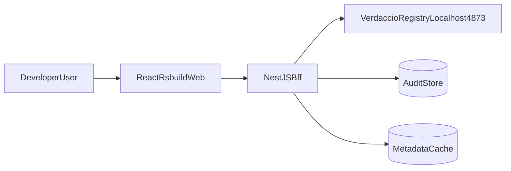

# Verdaccio 物料市场技术设计文档

## 1. 文档目的

本文档用于指导重构项目的设计与落地，目标是在保留现有 Verdaccio Registry 能力的前提下，建设新的前后端分离物料市场系统。

- 现有私源地址：`http://localhost:4873/`
- 新前端技术栈：`React + TypeScript + Axios + Rsbuild`
- 新后端技术栈：`NestJS（BFF 网关层）`
- 工程结构：`Turbo Monorepo`
- 复刻目标：对齐 Verdaccio 默认能力，分阶段达到 1:1 行为一致

## 2. 建设目标与非目标

### 2.1 建设目标

1. 提供可替换默认 Verdaccio Web UI 的新界面。
2. 提供 NestJS BFF 统一 API，屏蔽 Verdaccio 协议细节给前端。
3. 保持发布、安装、查询、版本与 tag 管理等关键行为与 Verdaccio 对齐。
4. 建立可维护的 Monorepo 与共享类型体系。
5. 全链路具备测试、日志、审计与后续扩展能力。

### 2.2 非目标（本阶段不做）

1. 不替换 Verdaccio 作为底层 Registry 引擎。
2. 不引入多租户、复杂计费、工作流审批等超出 Verdaccio 默认范围能力。
3. 不做与本地单机部署无关的跨地域高可用集群设计（可预留接口）。

## 3. 现状与约束

1. 当前工作区为空目录，需要从零初始化工程。
2. Verdaccio 继续运行在本地：`http://localhost:4873/`。
3. NestJS 作为 BFF 层，不直接重写 npm registry 协议核心。
4. 最终用户操作路径：浏览器 -> 新 Web UI -> NestJS BFF -> Verdaccio。

## 4. 目标架构设计



### 4.1 分层职责

1. `apps/web`（前端）
   - 展示包列表、包详情、版本、tag、发布入口、用户会话状态。
   - 只调用 BFF，不直接调用 Verdaccio。
2. `apps/api`（NestJS BFF）
   - 封装 Verdaccio API/Registry 调用。
   - 统一处理鉴权、鉴权透传、错误转换、审计记录、缓存读取。
3. `Verdaccio`
   - 继续承担包元数据存储、tarball、发布协议、用户权限核心能力。
4. `Audit/Cache`
   - 审计：记录关键写操作（发布、撤销、tag 变更、用户操作）。
   - 缓存：对包列表和详情做短期缓存，降低 Verdaccio 压力。

## 5. 1:1 功能映射矩阵（默认 Verdaccio -> 新系统）

| 模块 | Verdaccio 默认能力 | 新系统实现方式（Web + BFF） | 验收标准 |
| --- | --- | --- | --- |
| 用户登录 | `npm login` / Web 登录态 | BFF 提供登录接口，转发至 Verdaccio 用户认证并管理会话 | `npm login` 与 Web 登录均可获取可用 token |
| 用户注册 | `npm adduser` | BFF 封装用户创建流程（按 Verdaccio 配置是否开放） | 注册策略与原配置一致，异常码一致 |
| 包搜索 | UI 搜索、关键词过滤 | Web 搜索框 -> BFF 搜索聚合 -> Verdaccio 包列表 | 查询结果集合与 Verdaccio UI 一致 |
| 包详情 | 包描述、版本、dist-tags、README | BFF 聚合包元数据并格式化给前端 | 字段完整，空值和缺失包处理一致 |
| 版本列表 | 版本清单与时间线 | BFF 标准化排序（最新优先）并返回 | 版本顺序、时间展示与 Verdaccio 对齐 |
| dist-tags 管理 | 查看/更新标签 | BFF 封装 tag 查询/新增/更新/删除 | 标签变更可追溯，行为与 npm 命令一致 |
| 发布流程 | `npm publish` 上传包与元数据 | CLI 仍直接走 Verdaccio；Web 展示发布结果与历史 | 发布结果可在新 UI 及时可见 |
| 撤销/废弃 | `npm unpublish` / deprecate | BFF 提供管理接口并记录审计日志 | 权限、错误码、结果与 Verdaccio 一致 |
| 访问控制 | 包级权限（access） | BFF 读取 Verdaccio 配置并做权限门禁透传 | 无权限用户不可进行写操作 |
| 上游代理 | uplink 到 npmjs | 保留 Verdaccio 配置，BFF 仅展示状态 | 缓存命中与回源行为不受影响 |
| 错误处理 | Verdaccio 原生错误响应 | BFF 统一错误模型映射前端文案 | 关键错误类型可识别且便于排错 |
| 审计可追踪 | 默认较弱（依赖日志） | BFF 增加结构化审计日志 | 可按操作人/包名/时间追溯关键操作 |

## 6. API 契约与 BFF 设计

### 6.1 API 设计原则

1. 前端只认业务语义接口，不直接依赖 Verdaccio 的底层路径结构。
2. BFF 对外返回统一响应结构，保留必要的原始错误信息字段。
3. 鉴权采用“会话 + token 透传”双模式，以兼容 CLI 与 Web。
4. 所有写接口必须写入审计日志。

### 6.2 BFF 模块划分（NestJS）

1. `auth`：登录、退出、用户信息、token 生命周期处理。
2. `packages`：包列表、搜索、包详情、版本详情、README。
3. `dist-tags`：tag 查询与变更。
4. `publish-admin`：发布历史、撤销、废弃等管理能力。
5. `audit`：审计查询与导出。
6. `health`：健康检查、Verdaccio 联通状态、缓存状态。

### 6.3 对外接口草案（示例）

- `POST /api/v1/auth/login`
- `POST /api/v1/auth/logout`
- `GET /api/v1/auth/me`
- `GET /api/v1/packages?query=&page=&pageSize=`
- `GET /api/v1/packages/:packageName`
- `GET /api/v1/packages/:packageName/versions`
- `GET /api/v1/packages/:packageName/dist-tags`
- `PUT /api/v1/packages/:packageName/dist-tags/:tagName`
- `DELETE /api/v1/packages/:packageName/dist-tags/:tagName`
- `POST /api/v1/packages/:packageName/deprecate`
- `DELETE /api/v1/packages/:packageName/versions/:version`
- `GET /api/v1/audits`
- `GET /api/v1/health`

### 6.4 典型调用链（包详情）

1. Web 请求：`GET /api/v1/packages/:packageName`
2. BFF 先查缓存（短 TTL）
3. 未命中时调用 Verdaccio 元数据接口
4. BFF 标准化字段并返回
5. 写入缓存并记录访问日志（非审计级）

## 7. Turbo Monorepo 结构蓝图

```text
verdaccio-markplace/
  apps/
    web/                     # React + TS + Axios + Rsbuild
    api/                     # NestJS BFF
  packages/
    types/                   # 前后端共享 DTO / 类型
    tsconfig/                # 共享 tsconfig 基线
    eslint-config/           # 共享 lint 规则
    utils/                   # 可选：通用工具函数
  docs/
    architecture/
      verdaccio-marketplace-tech-design.md
  package.json
  pnpm-workspace.yaml
  turbo.json
```

### 7.1 工程规范

1. 包管理器：`pnpm`
2. 编译与任务编排：`turbo`
3. 语言：`TypeScript`（前后端统一）
4. 前端请求：`Axios`（统一拦截器注入会话信息）
5. API 契约：NestJS DTO + 可选 OpenAPI 导出

### 7.2 脚本约定（计划）

1. 根脚本
   - `pnpm dev`：并行启动 `web` 与 `api`
   - `pnpm build`：构建所有包
   - `pnpm lint`：全仓库静态检查
   - `pnpm test`：全仓库测试
2. `apps/web`
   - `dev/build/test/lint`
3. `apps/api`
   - `start:dev/build/test/lint`

## 8. 安全与鉴权设计

1. Web 用户登录后，BFF 维护短期会话并安全存储凭据。
2. BFF 调用 Verdaccio 时按用户上下文透传权限，不绕过原权限系统。
3. 对发布、撤销、tag 变更进行审计落库（操作者、目标包、变更内容、时间、结果）。
4. 统一错误码模型，避免前端暴露内部敏感细节。

## 9. 可观测性与稳定性

1. 结构化日志：请求 ID、用户、路径、耗时、错误码。
2. 健康检查：`api` 自检 + Verdaccio 连通检查 + 缓存状态检查。
3. 指标建议：QPS、P95 延时、错误率、缓存命中率、上游失败率。
4. 后续可接入 APM/Tracing（预留拦截器与 traceId 透传）。

### 9.1 注意项：当前开发环境为单实例

1. 当前开发态默认是单实例运行（一个 `api` 进程），`apps/api/src/cache/cache.service.ts` 使用进程内 `Map` 做缓存。
2. 该缓存只在当前 Node 进程内有效，不会跨实例共享，也不会在进程重启后保留。
3. 因此开发阶段看到的缓存命中率、TTL 行为仅代表单实例场景，不可直接等同生产多实例行为。
4. 若后续上生产采用多副本（如 PM2 cluster、K8s 多 Pod），建议替换为 Redis 等共享缓存并统一失效策略。
5. 是否返回 `304` 属于 HTTP 协商缓存机制（ETag/Last-Modified），与当前进程内 `Map` 命中不是同一层概念。

### 9.2 开发态 vs 生产态缓存对比表

| 维度 | 开发态（当前实现） | 生产态（推荐方案） |
| --- | --- | --- |
| 实例形态 | 单实例（单 Node 进程） | 多实例（多进程/多 Pod） |
| 缓存介质 | 进程内内存 `Map` | 共享缓存（如 Redis） |
| 缓存可见范围 | 仅当前进程 | 全部应用实例可共享 |
| 重启后缓存 | 丢失 | 可按策略保留（取决于 Redis 配置） |
| 一致性 | 单实例内一致，跨实例不可比 | 多实例间可统一失效与一致性控制 |
| 扩容影响 | 扩容收益有限（缓存不共享） | 水平扩容友好（缓存可复用） |
| 运维复杂度 | 低（开箱即用） | 中（需维护缓存组件与监控） |
| 适用阶段 | 本地开发 / 快速联调 | 线上生产 / 高并发与多副本部署 |
| 与 `304` 关系 | 无直接关系 | 同样无直接关系，`304` 仍由 HTTP 协商缓存决定 |

### 9.3 迁移到 Redis 的最小改造步骤清单（1-2 天版本）

#### Day 1：接入与兼容改造

1. 新增缓存抽象接口（例如 `CacheAdapter`），统一 `get/set/delete/getStats` 方法，避免业务层直接依赖具体实现。
2. 保留现有 `Map` 实现作为 `InMemoryCacheAdapter`（用于本地开发和回滚兜底）。
3. 新增 `RedisCacheAdapter`（推荐使用 `ioredis` 或 `redis` 客户端），实现与内存缓存一致的方法签名。
4. 增加环境变量：`CACHE_PROVIDER=inmemory|redis`、`REDIS_URL`、`CACHE_TTL_MS`。
5. 在 `AppModule` 中通过配置切换注入实现：开发默认 `inmemory`，预发/生产切换为 `redis`。
6. 健康检查增加 Redis 连通性探测（仅在 `CACHE_PROVIDER=redis` 时启用）。

#### Day 2：验证与灰度切换

1. 回归核心接口（包列表、包详情、版本、dist-tags）确保功能一致。
2. 增加最小监控项：Redis 可用性、命中率、平均耗时、错误率。
3. 小流量灰度：先在单个实例启用 Redis，其余实例保持内存缓存，观察 30-60 分钟。
4. 全量切换：全部实例启用 Redis，确认多实例缓存一致性与命中率稳定。
5. 保留快速回滚开关：出现异常时仅修改 `CACHE_PROVIDER` 即可退回内存缓存。

#### 验收标准（最小可用）

1. 多实例下同一 Key 的缓存读取结果一致。
2. 进程重启后缓存仍可命中（由 Redis 提供）。
3. 缓存异常不影响主流程（降级为直连 Verdaccio，接口可用）。
4. 切换和回滚均可在不改代码的前提下通过环境变量完成。

## 10. 测试策略与验收方法

### 10.1 测试分层

1. 单元测试
   - BFF 服务层：鉴权、错误映射、参数校验、缓存策略。
2. 契约测试
   - BFF 与 Verdaccio 的关键接口契约（状态码、字段结构、异常行为）。
3. E2E 测试
   - 登录、搜索、包详情、tag 管理、废弃/撤销等完整链路。
4. 回归测试
   - 使用功能映射矩阵逐项回归，对比 Verdaccio 原行为。

### 10.2 验收标准

1. 核心链路成功率 >= 99%（本地基线环境）。
2. 映射矩阵中的“核心能力项”全部通过。
3. 前端主要页面可独立演示，后端接口可用并可监控。
4. 关键写操作均可审计追溯。

## 11. 分阶段里程碑

### M1：文档与方案冻结

1. 本文档评审通过。
2. 功能映射矩阵与验收标准确认。

### M2：基础设施落地

1. Monorepo 初始化完成。
2. `web` 与 `api` 基础工程可运行。
3. 本地联调链路打通（Web -> BFF -> Verdaccio）。

### M3：核心能力交付

1. 登录/会话、包列表、包详情、版本与 tag 查询管理完成。
2. 发布结果可见与关键写操作审计完成。

### M4：增强能力与体验对齐

1. 权限细化与错误体验对齐 Verdaccio。
2. 缓存策略与可观测性完善。

### M5：1:1 复刻验收

1. 按映射矩阵完成全项回归。
2. 输出差异清单并关闭高优先级差异。

## 12. 代码注释与编码规范（中文注释要求）

### 12.1 注释原则

1. 注释语言：优先中文。
2. 注释目标：解释“为什么这样做”，而非重复“做了什么”。
3. 重点区域必须有注释：
   - 鉴权与安全逻辑
   - 与 Verdaccio 协议映射逻辑
   - 错误码转换与兼容处理
   - 缓存一致性与失效策略

### 12.2 推荐注释示例

```ts
// 这里对 Verdaccio 的 404 响应做兼容转换，避免前端把“包不存在”识别成系统异常。
if (verdaccioStatus === 404) {
  throw new PackageNotFoundException(packageName);
}
```

```ts
// 发布/撤销属于高风险写操作，必须先写审计日志，再返回接口结果。
await this.auditService.recordWriteOperation(operationPayload);
```

### 12.3 禁止项

1. 禁止无意义注释（例如“给变量赋值”）。
2. 禁止注释与实现不一致。
3. 禁止将安全敏感信息写入注释（token、密码、密钥）。

## 13. 后续落地清单（编码阶段）

1. 初始化 Monorepo 与基础配置文件。
2. 完成 `apps/api` 的模块骨架与 Verdaccio 客户端封装。
3. 完成 `apps/web` 的页面骨架与接口联调。
4. 建立共享类型与错误模型。
5. 建立测试基线并逐步完成映射矩阵回归。
